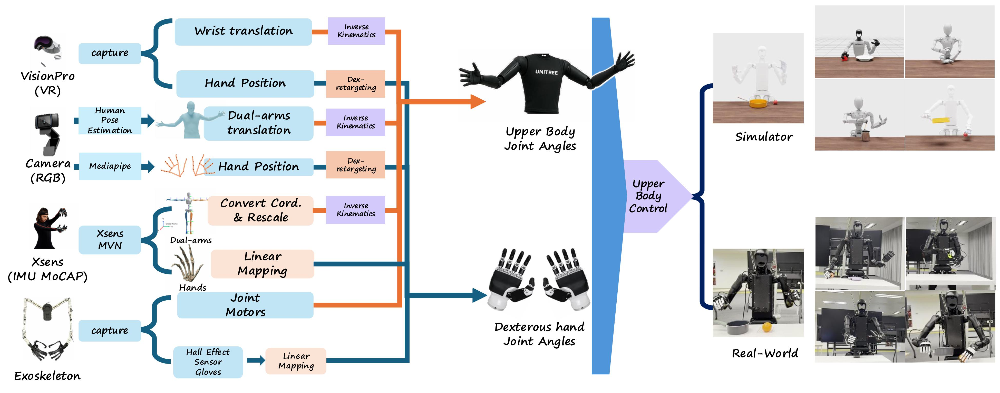

<h1 align="center">TeleOpBench: A Simulator-Centric Benchmark for Dual-Arm Dexterous Teleoperation</h1>

  <strong>TeleOpBench</strong> is a simulator-centric benchmark platform for dual-arm robot teleoperation. This project will open-source all related code, including teleoperation control, simulation environment, and real-world deployment solutions.

<!-- TODO List -->
##  TODO List
- [ ] Release TeleOperation Code
- [ ] Release Simulation Code
- [ ] Release Real-World Deployment Code